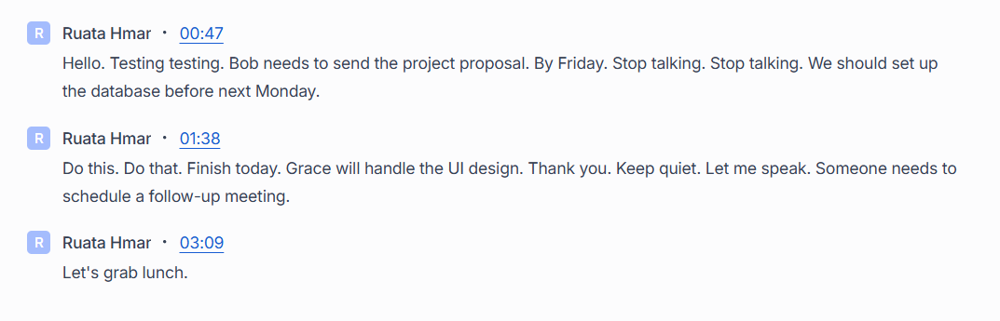
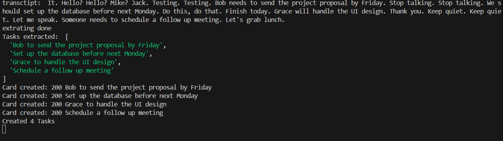
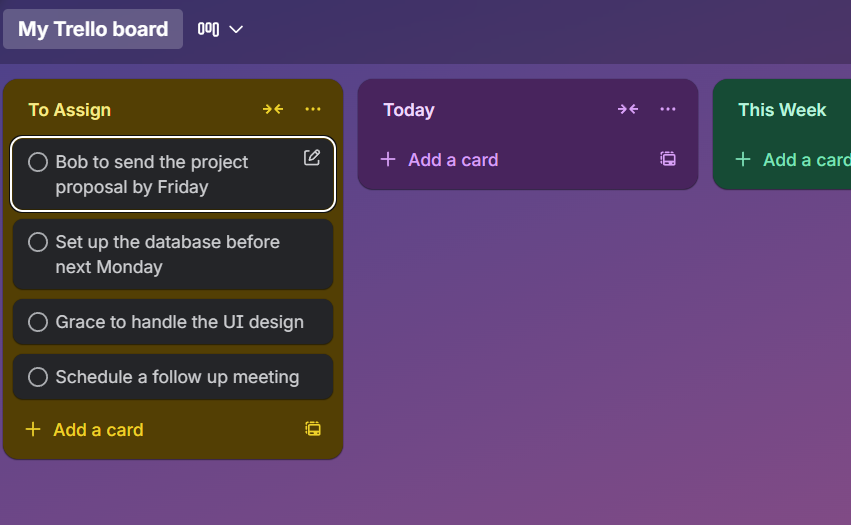

# Transcript to Tasks

Automatically converts meeting transcripts into Trello cards using AI. When a Google Meet ends, Fireflies.ai transcribes the meeting and sends it to this server, which uses Gemini to extract action items and creates Trello cards for each one.

## How it works

```
Google Meet → Fireflies.ai (transcription) → Webhook → Gemini AI (task extraction) → Trello Cards
```

## Prerequisites

- [Fireflies.ai](https://fireflies.ai) account with webhook access
- [Google Gemini](https://aistudio.google.com) API key
- [Trello](https://trello.com) account with API key and token
- Node.js
- [ngrok](https://ngrok.com) (for local testing)

## Setup

### 1. Clone and install

```bash
git clone <repo-url>
cd Transcript-to-tasks
npm install
```

### 2. Configure environment variables

Create a `.env` file in the root. A `.env.example` file is provided to be used as a template

**Getting your keys:**

- **Fireflies API key** → Fireflies dashboard > Settings > Developer Settings > API Key
- **Gemini API key** → [aistudio.google.com](https://aistudio.google.com)
- **Trello API key & token** → [trello.com/app-key](https://trello.com/power-ups/admin/), then generate a token via:
  ```
  https://trello.com/1/authorize?key=<Your-Key>&name=<Your-App-Name>&expiration=never&response_type=token&scope=read,write
  ```
- **Trello List ID** → Hit this in your browser and grab the `id` of your target list:
  ```
  https://api.trello.com/1/boards/<Your-Board-Id>/lists?key=<Your-api-key>&token=<Your-token>
  ```

### 3. Run the server

```bash
npm run dev
```

### 4. Expose your server with ngrok

```bash
ngrok http 8000
```

Copy the `https://xxxx.ngrok-free.app` URL.

### 5. Set up Fireflies webhook

In Fireflies dashboard → Settings > API & Webhooks → add your webhook URL:

```
https://xxxx.ngrok-free.app/fireflies/webhook
```

## Testing

1. Start a Google Meet
2. Invite the Fireflies Notetaker bot to the meeting
3. **Talk for atleast 5 to 6 minutes** — Fireflies requires a minimum meeting length to process transcripts. Mention clear action items like:
   - _"John needs to send the report by Friday"_
   - _"We should set up the database before the next sprint"_
   - _"Sarah will handle the UI designs"_
4. End the meeting and wait ~5 minutes for Fireflies to process the transcript
5. The webhook will fire automatically — check your terminal for logs and your Trello board for new cards

## Project Structure

```
src/
├── index.ts        # Express server and webhook handler
└── modules/
    └── services.ts # Fireflies, Gemini, and Trello
```

## Screenshots

### Demo Transcriptions:

- mixing normal command words with actual tasks in between



### Server terminal:



### Card creation:


